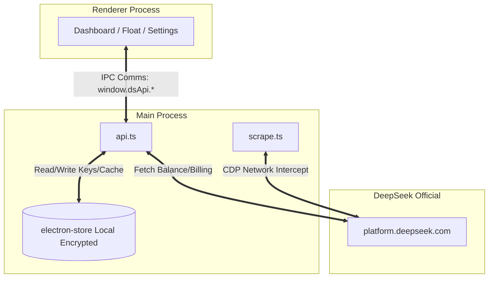

<p align="center">
  
</p>

<h1 align="center">DeepSeek Monitor</h1>

<p align="center">
  <b>English</b> | <a href="README.md">中文</a>
</p>

<p align="center">
  <b>A cream-themed desktop application for monitoring DeepSeek API quotas & usage, featuring an always-on-top floating window.</b><br/>
  <sub>Runs completely locally with zero telemetry. Instantly view your balance, daily/monthly requests, token consumption, and model distribution.</sub>
</p>

<p align="center">
  
  
  
  
</p>

---

## 📑 Table of Contents

- [Introduction](#-introduction)
- [Features](#-features)
- [Screenshots](#-screenshots)
- [Quick Start](#-quick-start)
- [Packaging](#-packaging)
- [Architecture](#-architecture)
- [Tech Stack](#-tech-stack)
- [Security & Privacy](#-security--privacy)
- [Known Limitations](#-known-limitations)
- [Contributing](#-contributing)
- [License](#-license)

---

## 💡 Introduction

DeepSeek Monitor is a third-party desktop monitoring tool tailored for DeepSeek API users. Running entirely locally, it helps developers track their API account balance, request counts, token consumption trends, and model usage distribution in real-time. Paired with a high-information-density floating window, your API data is always within sight.

---

## 🌟 Features

- **💰 API Balance**: Real-time querying via the official `/user/balance` endpoint.
- **📊 Usage Statistics**: Deep analysis of monthly requests, granular token input/output, model distribution, and cost.
- **📈 Model Dispatch Curve**: Provides a 7-day token consumption trend chart (when daily granular data is available).
- **🪟 Always-on-Top Floating Window**: Supports `alwaysOnTop` and dragging. Sits quietly in the corner of your screen with high information density.
- **🖱️ System Tray**: Convenient tray icon to instantly toggle the main dashboard visibility.
- **🤖 Smart Endpoint Learning**: Built-in "Diagnostic" feature to easily re-capture and bind to new internal platform endpoints when they change.
- **🔒 Local Encrypted Storage**: API Keys and login cookies are encrypted and stored strictly on your local machine. Nothing is ever uploaded to third parties.

---

## 📸 Screenshots

> **Main Dashboard:**
> 
>
> **Floating Window:**
> 

---

## 🚀 Quick Start

### Prerequisites
Ensure you have Node.js (v18+ recommended) and npm/yarn installed.

### Installation

```bash
# 1. Clone the repository
git clone https://github.com/<your-name>/deepseek-monitor.git

# 2. Enter directory
cd deepseek-monitor

# 3. Install dependencies
npm install

# 4. Start development server
npm run electron:dev
```

### Usage Guide

After starting the app, head over to the "Settings" page for initial setup:
1. **Configure Key:** Enter your [DeepSeek API Key](https://platform.deepseek.com/api_keys) and click "Test Connection".
2. **Account Authorization:** Click "Login DeepSeek" and log in securely via the popup window.
3. **Endpoint Binding:** Click "Diagnose API", navigate to the "Usage" page in the newly opened browser window → wait for data to load → close the window.
4. **Done:** Automatic binding will succeed. Return to the main dashboard to view all real-time metrics.

---

## 📦 Packaging

To package the project into executables for your platform, run:

```bash
# Build the application for the current platform
npm run electron:build
```

Build outputs will be generated in the `release/` directory:
- Windows: Generates an `.exe` installer.
- macOS: Generates a `.dmg` file.
- Linux: Generates an `AppImage`.

> **Note:** To customize application icons, place your `icon.ico` / `icon.icns` / `icon.png` inside the `build/` directory.

---

## 🏗️ Architecture

```text
deepseek-monitor/
├─ electron/                   # Main Process (Node.js)
│  ├─ main.ts                  # Window lifecycle / Tray / IPC registration
│  ├─ api.ts                   # Balance + usage data scraping & normalization
│  ├─ scrape.ts                # CDP-based XHR interceptor/diagnostic tool
│  ├─ preload.ts               # contextBridge exposing window.dsApi
│  └─ store.ts                 # electron-store local encrypted storage
├─ src/                        # Renderer Process (React + Vite)
│  ├─ App.tsx                  # Simple hash routing
│  ├─ main.tsx                 # Frontend entry point
│  ├─ styles.css               # Tailwind + custom cream theme configuration
│  ├─ types.ts                 # Shared types & IPC definitions
│  ├─ components/              # Reusable components (TitleBar, StatCard, etc.)
│  └─ pages/                   # Independent views (Dashboard, Settings, Float)
├─ public/                     # Static assets
│  └─ logo.svg                 # Application vector icon
├─ build/                      # Packaged resources (installer icons)
└─ package.json / tsconfig.json...
```

### Data Flow



---

## 🛠️ Tech Stack

- **Framework**: Electron 33 + Vite 5
- **Frontend**: React 18 + TypeScript 5
- **Styling**: TailwindCSS (Deeply customized `cream` / `warm` / `accent` color palette)
- **Data Visualization**: Recharts
- **Storage**: electron-store (Pure local encrypted KV storage)
- **Network Diagnostic**: Chrome DevTools Protocol (Low-level intercept for internal XHR requests)

---

## 🛡️ Security & Privacy

Data security is our top priority:
This application is a **purely local** desktop tool. **There are no backend servers, and all forms of telemetry or tracking are strictly prohibited**.
Your API Keys and login session data are encrypted and stored exclusively on your own hard drive.

For more details, see [SECURITY.md](SECURITY.md).

---

## ⚠️ Known Limitations

- **Undocumented API Dependency**: The usage detail endpoints on DeepSeek are not official public APIs. If the platform undergoes restructuring, the endpoint addresses may change. To mitigate this, the app features a "Diagnostic API" tool to re-capture and bind new endpoints with one click.
- **Granularity Limits**: Due to official data dimension limitations, some months may return cumulative monthly data rather than daily granular data. In such cases, the "Today" metric on the dashboard will merge and display as "This Month Cumulative".

---

## 🤝 Contributing

Pull Requests are highly welcomed!
- When submitting bug fixes, new features, or UI tweaks, please attach screenshots in your PR.
- If official platform endpoints change, feel free to add new adapters by extending the `normalizeDsNative` function in `electron/api.ts`.

---

## 📄 License

This project is licensed under the [MIT License](LICENSE).

© 2026 MiaTxxx
