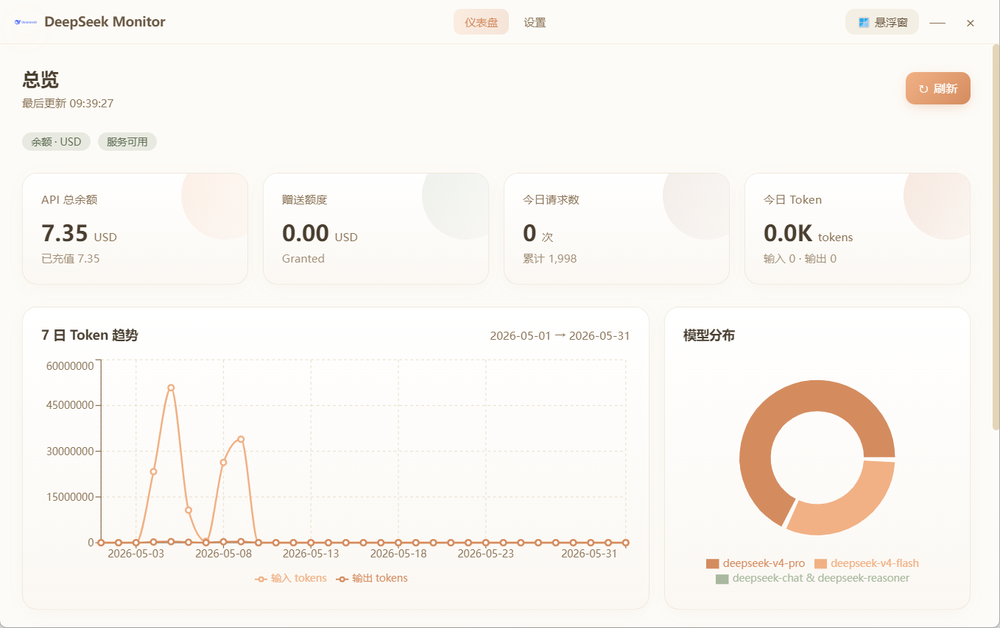
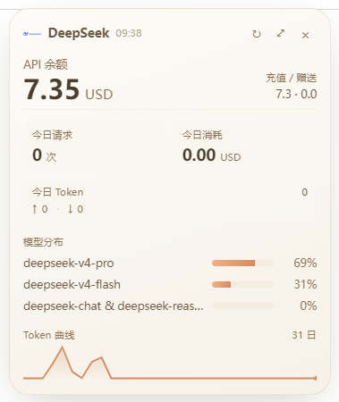
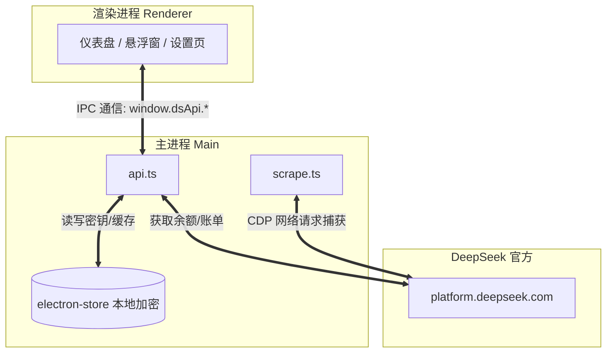

<p align="center">
  
</p>

<h1 align="center">DeepSeek Monitor</h1>

<p align="center">
  <a href="README.en.md">English</a> | <b>中文</b>
</p>

<p align="center">
  <b>暖白风的 DeepSeek 账户额度 & 用量监测桌面应用，带常驻悬浮窗。</b><br/>
  <sub>本地运行，零遥测，一眼看到你的余额、今日/本月请求数、Token 消耗与模型分布。</sub>
</p>

<p align="center">
  
  
  
  
</p>

---

## 📑 目录导航

- [项目介绍](#-项目介绍)
- [功能特性](#-功能特性)
- [界面预览](#-界面预览)
- [快速开始](#-快速开始)
- [打包编译](#-打包编译)
- [核心架构](#-核心架构)
- [技术栈](#-技术栈)
- [安全与隐私](#-安全与隐私)
- [已知限制](#-已知限制)
- [参与贡献](#-参与贡献)
- [开源协议](#-开源协议)

---

## 💡 项目介绍

DeepSeek Monitor 是一款专为 DeepSeek API 用户打造的第三方桌面监测工具。通过纯本地运行的方式，帮助开发者实时追踪 API 的账户余额、接口调用次数、Token 消耗趋势以及各类模型的用量占比。搭配高信息密度的系统悬浮窗，让 API 数据尽在掌握。

---

## 🌟 功能特性

- **💰 API 余额**：通过官方 `/user/balance` 接口实时查询
- **📊 用量统计**：深度分析本月请求数、Token 输入/输出细分、模型分布及消耗金额
- **📈 模型调度曲线**：提供带有日粒度数据的 7 日 Token 消耗趋势图
- **🪟 常驻悬浮窗**：支持 `alwaysOnTop` 与拖拽，以极高的信息密度常驻桌面角落
- **🖱️ 系统托盘**：提供便捷的系统托盘图标，一键隐藏/显示主监控面板
- **🤖 智能接口学习**：当官方平台内部接口变动时，通过「诊断」功能可一键重新抓取绑定
- **🔒 本地加密存储**：API Key 与登录 Cookie 仅经过加密存在本机，绝不上传任何第三方

---

## 📸 界面预览

> **主面板视图：**
> 
>
> **常驻悬浮窗：**
> 

---

## 🚀 快速开始

### 环境依赖
确保您已安装 Node.js (推荐 v18+) 与 npm/yarn。

### 安装步骤

```bash
# 1. 克隆仓库
git clone https://github.com/<your-name>/deepseek-monitor.git

# 2. 进入目录
cd deepseek-monitor

# 3. 安装依赖
npm install

# 4. 启动开发环境
npm run electron:dev
```

### 使用指南

启动应用后，请进入「设置」页完成初始化：
1. **配置密钥：** 填入你的 [DeepSeek API Key](https://platform.deepseek.com/api_keys)，并点击「测试连接」。
2. **账号授权：** 点击「登录 DeepSeek」，在弹出的独立安全窗口中完成账号登录。
3. **接口绑定：** 点击「诊断接口」，在新弹出的浏览器窗口里点击进入「用量统计」页 → 等待数据加载完毕 → 关闭窗口。
4. **完成：** 自动绑定成功，返回主面板即可查看所有实时监测数据。

---

## 📦 打包编译

如果需要将项目打包为各平台的可执行文件，请运行：

```bash
# 构建当前平台的应用程序
npm run electron:build
```

产物将输出在 `release/` 目录中。
- Windows: 将生成 `.exe` 安装器
- macOS: 将生成 `.dmg` 文件
- Linux: 将生成 `AppImage` 文件

> **注：** 若需自定义应用图标，请将对应的 `icon.ico` / `icon.icns` / `icon.png` 放置在 `build/` 目录下。

---

## 🏗️ 核心架构

```text
deepseek-monitor/
├─ electron/                   # 主进程 (Node.js)
│  ├─ main.ts                  # 窗口生命周期 / 托盘 / IPC 注册
│  ├─ api.ts                   # 余额 + 用量的数据抓取与归一化逻辑
│  ├─ scrape.ts                # 基于 CDP 捕获 XHR 的诊断器
│  ├─ preload.ts               # contextBridge 暴露 window.dsApi
│  └─ store.ts                 # electron-store 本地加密存储
├─ src/                        # 渲染进程 (React + Vite)
│  ├─ App.tsx                  # 简易 hash 路由
│  ├─ main.tsx                 # 前端入口点
│  ├─ styles.css               # Tailwind + 暖白主题配置
│  ├─ types.ts                 # 共享类型及 IPC 类型定义
│  ├─ components/              # 可复用组件 (TitleBar, StatCard 等)
│  └─ pages/                   # 独立视图页面 (Dashboard, Settings, Float)
├─ public/                     # 静态资源
│  └─ logo.svg                 # 应用矢量图标
├─ build/                      # 打包资源（安装包图标等）
└─ package.json / tsconfig.json...
```

### 数据流向



---

## 🛠️ 技术栈

- **框架底座**：Electron 33 + Vite 5
- **前端开发**：React 18 + TypeScript 5
- **界面样式**：TailwindCSS (深度定制 `cream` / `warm` / `accent` 暖白主题色板)
- **数据可视化**：Recharts
- **数据存储**：electron-store (纯本地加密 KV 存储)
- **网络诊断**：Chrome DevTools Protocol (底层捕获平台内部 XHR 请求)

---

## 🛡️ 安全与隐私

数据安全是我们最关注的核心：
本应用为 **纯本地化运行** 的桌面级工具，**没有任何后端服务器、禁止任何形式的遥测（Telemetry）或数据埋点**。
你的 API Key 及登录信息仅经过加密后保存在你自己的电脑硬盘中。

详见 [SECURITY.md](SECURITY.md) 获取更详细的安全说明。

---

## ⚠️ 已知限制

- **非公开 API 依赖**：DeepSeek 平台的用量明细接口并非官方公开的 API，当平台发生重构或改版时可能导致接口地址发生变化。为此，应用内建了「诊断接口」功能，可借此实现一键抓取并重新绑定新接口。
- **颗粒度限制**：部分月份由于官方数据维度原因，返回的可能是月度累计数据而非细化到日的日粒度数据，此时仪表盘上的「今日」指标将会合并显示为“本月累计”。

---

## 🤝 参与贡献

非常欢迎各位提交 Pull Request：
- 提交 Bug 修复、新功能或 UI 调整时，请在 PR 中附带相关的截图说明。
- 若官方平台接口变动，欢迎通过扩展 `electron/api.ts` 中的 `normalizeDsNative` 函数来新增接口适配器。

---

## 📄 开源协议

本项目基于 [MIT License](LICENSE) 协议开源。

© 2026 MiaTxxx